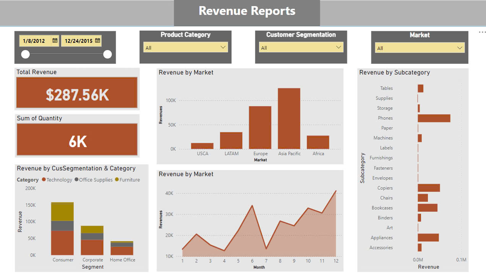

# Transaction Sale Data ETL Analyst

## Project Overview
This project focuses on building a complete ETL pipeline to extract, load, and transform transaction data. The processed data is used to create a Power BI dashboard for visualizing key business metrics like revenue, product categories, customer segments, and markets.

The pipeline involves the following main steps:
1. **Data extraction** from raw transaction data (CSV format).
2. **Data staging** in Microsoft SQL Server.
3. **ETL process** for transforming and modeling data.
4. **Dashboard creation** in Power BI for data visualization.

---

## Pipeline Overview

### 1. **Raw Data (CSV File)**
   - Raw transaction data is provided in CSV format. This data includes information about products, customers, regions, and sales.

   

### 2. **Staging in SQL Server**
   - The raw data is imported into a staging table in SQL Server for initial loading and organization.

   

### 3. **ETL and Data Modeling**
   - The ETL (Extract, Transform, Load) process involves cleaning, transforming, and loading the staged data into the final fact and dimension tables in SQL Server. These tables are used for analysis and reporting.

   

### 4. **Power BI Dashboard**
   - A Power BI dashboard is created to visualize key metrics. The dashboard includes total revenue, quantity sold, revenue by product categories, and market segmentation.

   

---

## Data Model

The data model consists of a central fact table for sales orders, connected to dimension tables for products, customers, regions, and time. Below is the star schema model used in the pipeline:

- **Fact Table**: `fact_salesorder` containing details about each order.
- **Dimension Tables**:
  - `dim_product`: Product information (Category, Subcategory, Product Name).
  - `dim_customer`: Customer details (Customer ID, Name, Segment).
  - `dim_region`: Regional data (Country, State, Postal Code).
  - `dim_time_order`: Time details (Order Date, Order Month, Order Year).
  - `dim_time_shipping`: Shipping details (Shipping Date, Shipping Mode).

---

## Tools and Technologies
The following technologies were used in this project:
- **Microsoft SQL Server** for data storage and staging.
- **Power BI** for data visualization and dashboard creation.
- **CSV** for raw data storage and extraction.
- **SSIS (SQL Server Integration Services)** for ETL orchestration.

---

## How to Use

1. **Load the raw CSV data** into the SQL Server staging table.
2. **Run the ETL process** to clean and transform the data.
3. **Open the Power BI file** to visualize the insights from the transformed data.

Feel free to explore the repository for further details about the implementation of each phase of the pipeline.

---

## License
This project is licensed under the MIT License. See the `LICENSE` file for details.
